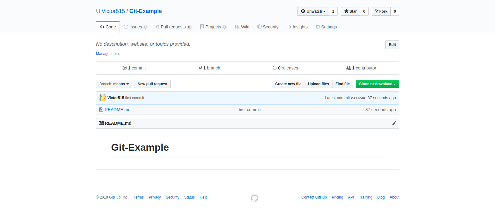
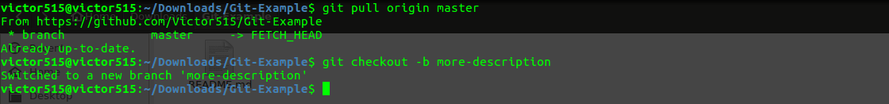
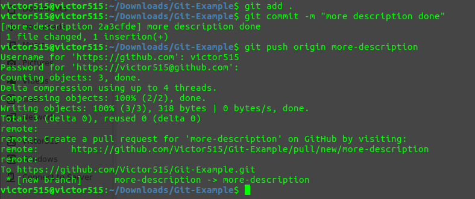
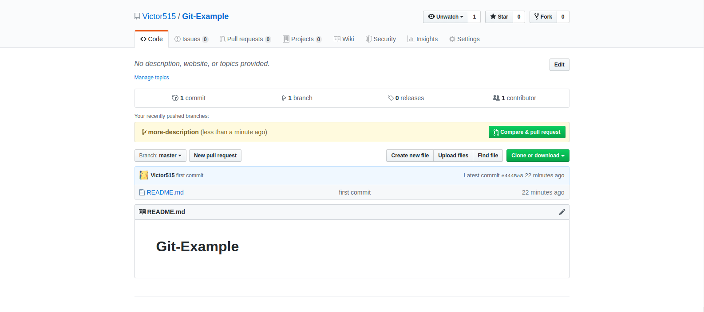
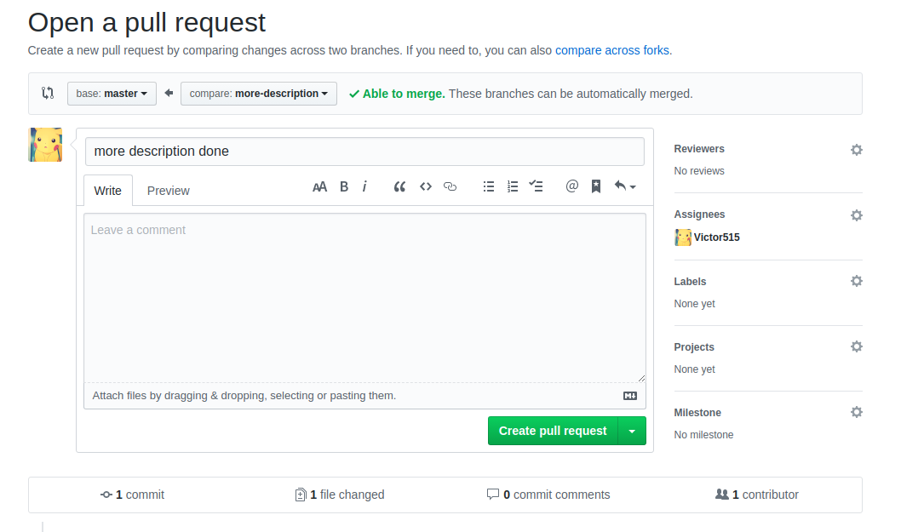
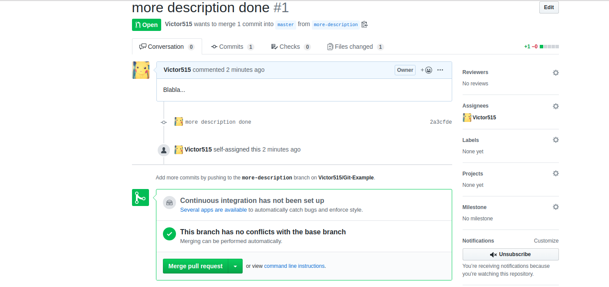
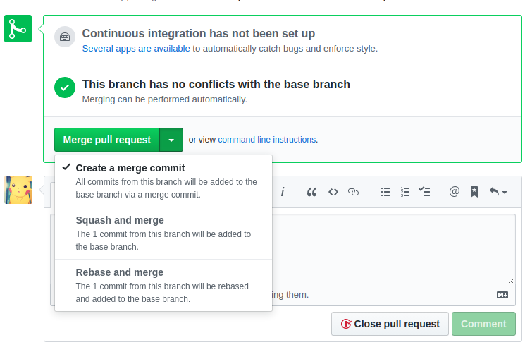

# Git WorkFlow

This document is about how to use git to collaborate with your team members.


The gist of this workflow is that: the tip of master branch is always the latest, **working** branch. If someone wants to work on a new feature, he/she needs to create a feature branch and work on that. After everything is done, he can then push that branch to remote repository (for our case, github), and create a pull request.


## Step-by Step example

Scenario: Currently we have a repository named "Git-Example". It has only one file in it: README.md. Suppose one person wants to change README.md by adding more description in it.



Step1. In this own local repository,  run

```bash
git pull origin master
```

To pull the latest version of master.


Step2. Before writing any code, run

```bash
git checout -b more-description
```

To create a new branch named "more-description" and then check it out.




Step3. Now one can start to work on the code. Here we just add one line to the README file.

```bash
echo "This repository contains some fancy examples about using git!" >> README.md
```


Step4. If one thinks that everything is working, he can commit code and  push his branch to remote repository with

```bash
git add .
git commit -m "more description done!"
git push origin more-description
```




Step5. Now, on the github repository page, there will be a notification telling that "more-description" is just pushed. One can click on the button "compare & pull request" to create a pull request.




Step6. On the "Open pull request" page, add more description.  On the right-hand, choose any reviewer for this PR (usually it is your tech lead). Then one click on the "Create pull request" button.




Step7. Everything is done! One can now notify his tech lead about this PR and wait for it to be merged.




## Q&A

1. What if there are merge conflicts when a PR is created?

   Answer: This usually means there are some updates after the last time you pull the master branch. Go back to your local repository and run ```git pull origin master``` again. Then you need to either merge master into your feature branch or rebase it to master. After that, you just run `git push origin name-of-branch` again, and you will see updates in the PR page and conflicts will be gone.


2. What if tech lead thinks the code requires modification before merging into master?

   Answer: The feature developer should then go back to modify the code as tech lead specifies. Then he can run `git push origin name-of-branch` again to update PR.


3. There are three ways to merge PR, what are their difference?

   

   Answer: <https://help.github.com/en/github/collaborating-with-issues-and-pull-requests/about-pull-request-merges>

